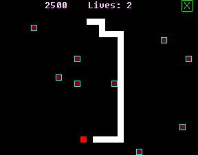



## \[NibbleWorm\]

### Description

(new version 1.0.6! i added a bomb that makes you shorter as a powerup! Also, spacebar is now pause! and i've fixed a few bugs and now this game is almost flawless...) A cool nibbles game that I decided to make for no reason... There are 4 different speeds, each with a bonus (whenever you eat one of those things you get the set score + the bonus) and 3 different options. With a cool sound module that u can use anytime and a cool FormOnTop module that u can use. it's pretty cool. Neatly documented too. Also, it doesn't use any images! teaches you how to load objects in an array and stuff. Also, it teaches you how to use a filesystemobject to read/write in text documents (my games save the highscore). It also teaches you how to make cool button effects. It's pretty fun and addictive.
 
### More Info
 

             |
---                |---
**Submitted On**   |2002-11-22 20:45:46
**By**             |[Jason Liang](https://github.com/Planet-Source-Code/PSCIndex/blob/master/ByAuthor/jason-liang.md)
**Level**          |Intermediate
**User Rating**    |4.8 (29 globes from 6 users)
**Compatibility**  |VB 3\.0, VB 4\.0 \(16\-bit\), VB 4\.0 \(32\-bit\), VB 5\.0, VB 6\.0
**Category**       |[Games](https://github.com/Planet-Source-Code/PSCIndex/blob/master/ByCategory/games__1-38.md)
**World**          |[Visual Basic](https://github.com/Planet-Source-Code/PSCIndex/blob/master/ByWorld/visual-basic.md)
**Archive File**   |[\[A\_cool\_ve1604586222003\.zip](https://github.com/Planet-Source-Code/jason-liang-nibbleworm__1-46351/archive/master.zip)

